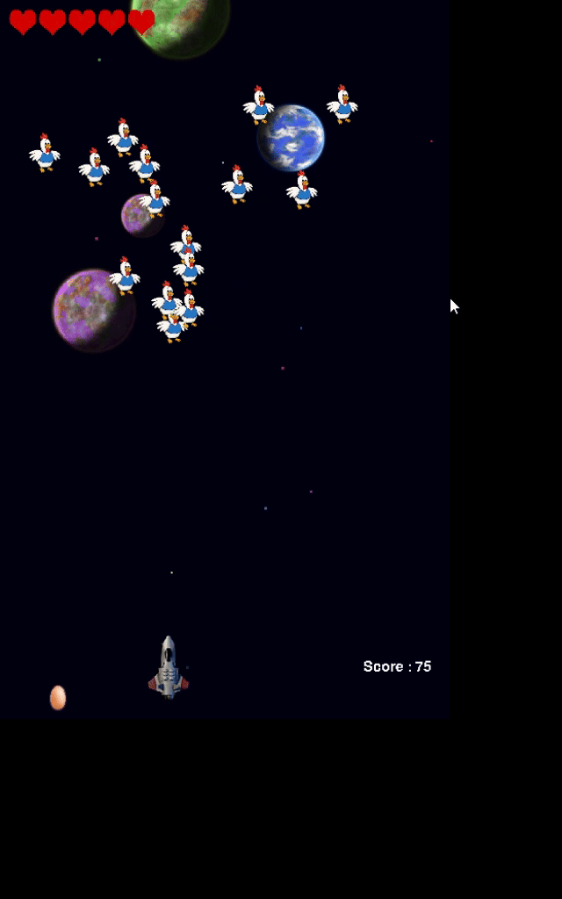

# 🐔 Hyper_Hen

Oyunun içinden ufak bir kare:

[](assets/gif2.gif)

# 🐔 Hyper_Hen

Retro tarzda geliştirilen 2D uzaylı tavuk vurma oyunu. Python ve Pygame ile yazılmıştır.  
Arcade oyun tarzında eğlenceli ve aksiyon dolu bir shooter deneyimi sunar.

---

## 🎮 Oyun Açıklaması

Oyuncu, uzay gemisi ile düşman tavukları ve yumurtalarını vurarak hayatta kalmaya çalışır.  
Her dalgada zorluk artar, refleksler test edilir. Hedef: en yüksek skoru yapmak!

---

## 🕹️ Nasıl Oynanır?

- ⬅️ ➡️ Yön tuşlarıyla hareket et
- SPACE tuşu ile ateş et
- Düşmanlardan kaç, tavukları vur
- Bölüm geçtikçe oyun hızlanır
- Her düşman dalgasını temizlediğinde 1 can kazanırsın
- Canın biterse oyun sona erer

---

## 🛠️ Özellikler

- ✅ Pygame tabanlı
- ✅ Bölüm geçiş sistemi
- ✅ Ses ve animasyonlar
- ✅ Çarpışma sistemi
  


---

## 📥 Kurulum

1. Python 3.10+ kurulu olmalı
2. Bağımlılıkları yükle:
   ```bash
   pip install pygame

## 👥 Katkıda Bulunanlar

| İsim                | GitHub Kullanıcı Adı       |
|---------------------|----------------------------|
| Hakan Tarık Karaduman | [Dev221122](https://github.com/Dev221122) |
| Ayberk Erkan         | [aayberk7](https://github.com/aayberk7)     |
| Yunus Emre Argun     | [Yunus-Emre-Argun](https://github.com/Yunus-Emre-Argun) |
